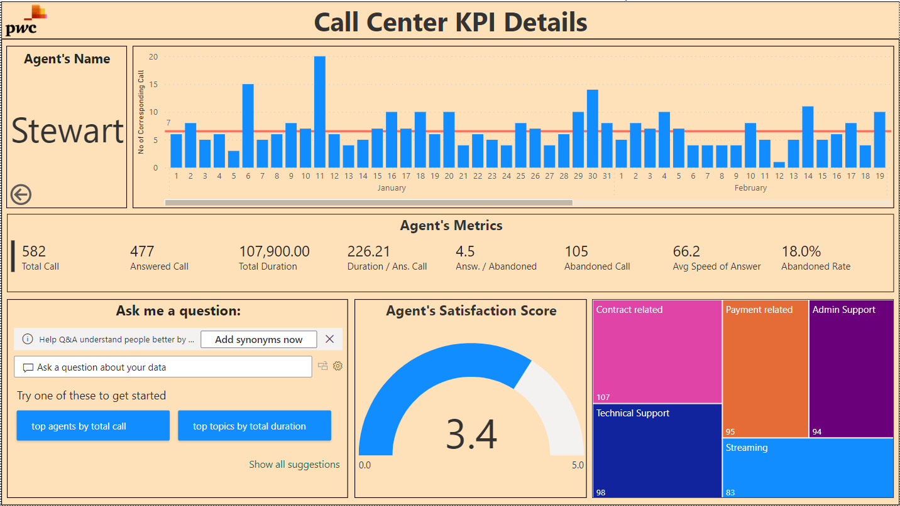

# PwC Switzerland Virtual Case Experience


This virtual Experience is held by PwC (PricewaterhouseCoopers) Switzerland. In this virtual experience case, I have been given some tasks to simulate a condition in which I work together in a team to help client solve their problems by using technology. Power BI is used in the experience case to clean, wrangle, and visualize data so that client can better understand their customers and employees. There are 3 assigment topics in this case, i.e.: The Call Centre Trends, The Customer Retention, and the Diversity and Inclusion.

There are 3 Datasets used in this project, i.e.:
1. 01 Call-Center-Dataset.xlsx
2. 02 Churn-Dataset.xlsx
3. 03 Diversity-Inclusion-Dataset.xlsx


## 1. The Call Centre Trends
### Lesson Learned:
1. The importance of upskilling in the digital age and its role in the workplace.
2. The concept of becoming a "Digital Accelerator" and the skills associated with it.
3. How to create a Power BI dashboard for visualizing key performance indicators (KPIs) and metrics.

### Tasks:
Create a dashboard in Power BI for Claire that reflects all relevant Key Performance Indicators (KPIs) and metrics in the dataset.

### Dataset source: 

`https://cdn.theforage.com/vinternships/companyassets/4sLyCPgmsy8DA6Dh3/01%20Call-Center-Dataset.xlsx`

(The above dataset source links was last accessed in November 8, 2023)

| **Field Name** | **Data Type** |
| ------ | ------ |
| Call Id | Text|
| Agent | Text |
| Date | Date |
| Time | Time |
| Topic | Text |
| Answered (Y/N) | Text |
| Resolved | Text |
| Speed of answer in seconds |Decimal Number |
| AvgTalkDuration | Time |
| Satisfaction rating | Decimal Number |

### Solutions:

Possible KPIs include (to get started, but not limited to):

1. Overall customer satisfaction
2. Overall calls answered/abandoned
3. Calls by time
4. Average speed of answer
5. Agent’s performance quadrant -> average handle time (talk duration) vs calls answered

**Adding Calculated Fields and DAX (Data Analysis eXpression)**
- Adding Abandoned Rate
```Sh
Abandoned Rate = DIVIDE([No of Abandoned Call],DISTINCTCOUNT(CallData[Call Id]))
```
- Adding Answ to Abandoned Rate
```Sh
Answ to Abandoned Rate = DIVIDE([No of Answered Call],[No of Abandoned Call])
```
- Adding Avg Speed of Answer
```Sh
Avg Speed of Answer = DIVIDE(SUM(CallData[Speed of answer in seconds]),[No of Answered Call])
```
- Adding Call Resolution Rate (%)
```Sh
Call Resolution Rate (%) = DIVIDE([Resolved Call],[No of Answered Call])
```
- Adding Duration per Answered Call
```Sh
Duration per Answered Call = DIVIDE(CALCULATE(sum(CallData[CallDuration]),CallData[CallDuration]>0),[No of Answered Call])
```
- Adding No of Abandoned Call
```Sh
No of Abandoned Call = CALCULATE(COUNT(CallData[Call Id]),'CallData'[Answered (Y/N)]="N")
```
- Adding No of Answered Call
```Sh
No of Answered Call = CALCULATE(COUNT(CallData[Call Id]),'CallData'[Answered (Y/N)]="Y")
```
- Adding Resolved Call
```Sh
Resolved Call = CALCULATE(COUNT(CallData[Resolved]), AND(CallData[Answered (Y/N)]="Y",CallData[Resolved]="Y"))
```
- Adding Satisfaction Score
```Sh
Satisfaction Score = DIVIDE(CALCULATE(SUM(CallData[Satisfaction rating]),CallData[Answered (Y/N)]="Y"),[No of Answered Call])
```
- Adding Total Call
```Sh
Total Call = DISTINCTCOUNT(CallData[Call Id])
```
- Adding Total Duration
```Sh
Total Duration = CALCULATE(SUM(CallData[CallDuration]),CallData[CallDuration]>0)
```

**The Call Center Data Model**


There are 2 pages were created for the solution. The KPI Dashboard and the Detail Page.

**The KPI Dashboard**


**The Detail Page**



### Link to dashboard:

The online report of the power bi can be found [here](https://app.powerbi.com/links/_jx5u479wZ?ctid=af2c0734-cb42-464f-b6bf-2a241b6ada56&pbi_source=linkShare)

## 2. The Customer Retention

Customers in the telecom industry are hard-earned and the company doesn't want to lose them. The retention department is here to get customers back in case of termination . Currently, they get in touch after they have terminated the contract, but this is reactionary. Therefore, it would be better to know in advance who is at risk . They have done customer analysis with Excel, buta it has always ended in a dead-end. They would like to know more about our customers and the Retentions Manager has provided some information in the resources.

### Lesson Learned:
1. How to define key performance indicators (KPIs) related to customer retention.
2. How to create a dashboard that visualizes customer demographics and insights.

### Tasks:
1. Define proper KPIs
2. Create a dashboard using the defined KPIs to reflect customer demographics and insights.

### Dataset Source:

`https://cdn.theforage.com/vinternships/companyassets/4sLyCPgmsy8DA6Dh3/02%20Churn-Dataset.xlsx`

(The above dataset source links were last accessed in November 8, 2023)

| **Field Name** | **Data Type** |
| ------ | ------ |
| CustID | Text|
| Gender | Text |
| SeniorCitizen | Text |
| Partner | Text |
| Dependents | Text |
| Tenure_(Month) | Whole Number |
| Phone | Text |
| MultipleLines | Text |
| Internet | Text |
| OnlineSecurity | Text |
| OnlineBackup | Text|
| DeviceProtection | Text |
| TechSupport | Text |
| StreamingTV | Text |
| StreamingMovies | Text |
| Contract | Text |
| PaperlessBilling | Text |
| PaymentMethod | Text |
| MonthlyCharges | Decimal Number |
| TotalCharges | Currency / Fixed Decimal Number |
| #AdminTickets | Whole Number |
| #TechTickets | Whole Number |
| Churn | Text |
| SubsPeriod | Text |
| PaymentGroup | Text |

### Solutions:

**Adding Calculated Fields and DAX (Data Analysis eXpression)**

- Adding # Customer
```Sh
# Customer = DISTINCTCOUNT(ChurnDataset[CustID])
```
- Adding # Dependents
```Sh
# Dependents = CALCULATE(DISTINCTCOUNT(ChurnDataset[CustID]),ChurnDataset[Dependents]="Yes")
```
- Adding # DeviceProtection
```Sh
# DeviceProtection = CALCULATE(DISTINCTCOUNT(ChurnDataset[CustID]),ChurnDataset[DeviceProtection]="Yes")
```
- Adding # NonPaperless
```Sh
# NonPaperless = CALCULATE(DISTINCTCOUNT(ChurnDataset[CustID]),ChurnDataset[PaperlessBilling]="No")
```
- Adding # OnlineBackup
```Sh
# OnlineBackup = CALCULATE(DISTINCTCOUNT(ChurnDataset[CustID]),ChurnDataset[OnlineBackup]="Yes")
```
- Adding # OnlineSecurity
```Sh
# OnlineSecurity = CALCULATE(DISTINCTCOUNT(ChurnDataset[CustID]),ChurnDataset[OnlineSecurity]="Yes")
```
- Adding # Paperless
```Sh
# Paperless = CALCULATE(DISTINCTCOUNT(ChurnDataset[CustID]),ChurnDataset[PaperlessBilling]="Yes")
```
- Adding # Partner
```Sh
# Partner = CALCULATE(DISTINCTCOUNT(ChurnDataset[CustID]),ChurnDataset[Partner]="Yes")
```
- Adding # Senior Citizen
```Sh
# Senior Citizen = CALCULATE(DISTINCTCOUNT(ChurnDataset[CustID]),ChurnDataset[SeniorCitizen]="Yes")
```
- Adding # StreamingMovies
```Sh
# StreamingMovies = CALCULATE(DISTINCTCOUNT(ChurnDataset[CustID]),ChurnDataset[StreamingMovies]="Yes")
```
- Adding # StreamingTV
```Sh
# StreamingTV = CALCULATE(DISTINCTCOUNT(ChurnDataset[CustID]),ChurnDataset[StreamingTV]="Yes")
```
- Adding # TechSupport
```Sh
# TechSupport = CALCULATE(DISTINCTCOUNT(ChurnDataset[CustID]),ChurnDataset[TechSupport]="Yes")
```
- Adding #Churn
```Sh
#Churn = CALCULATE(count(ChurnDataset[Churn]),ChurnDataset[Churn]="Yes")
```
- Adding Churn Rate
```Sh
Churn Rate = DIVIDE('Measures Table'[#Churn],[# Customer])
```

**The Call Center Data Model**


**The Churn Analysis Dashboard**

The Curn Rate Dashboard to help analyze the Retention Rate


### Link to dashboard:

The online report of the power bi can be found [here](https://app.powerbi.com/links/2DFLi_ipSW?ctid=af2c0734-cb42-464f-b6bf-2a241b6ada56&pbi_source=linkShare)

## 3. Diversity and Inclusion

Human Resources at our telecom client is highly into diversity and inclusion. They’ve been working hard to improve gender balance at the executive management level, but they’re not seeing any progress. They’re reaching out to PwC for seeking support with diversity and inclusion. Companies need a workforce of diverse talents and backgrounds to succeed in an increasingly complex and heterogeneous world. Diversity and inclusion are business imperatives, not just nice-to-haves. Achieving this and unlocking its potential involves a whole set of practical challenges.

### Lesson Learned:
1. How to define key performance indicators (KPIs) related to gender balance and diversity.
2. How to create visualizations that represent HR data effectively.
3. The imperatives of diversity and inclusion in the corporate world.

### Tasks:
1. Create visualizations to represent HR data, particularly focusing on gender-related KPIs.
2. Identify and discuss potential root causes for the slow progress in achieving gender balance at the executive management level.

### Dataset source: 

`https://cdn.theforage.com/vinternships/companyassets/4sLyCPgmsy8DA6Dh3/03%20Diversity-Inclusion-Dataset.xlsx`

(The above dataset source links were last accessed in November 8, 2023)

| **Field Name** | **Data Type** |
| ------ | ------ |
| Employee ID | Text|
| Gender | Text |
| Job Level after FY20 promotions | Text |
| New hire FY20? | Text |
| FY20 Performance Rating | Decimal Number |
| Promotion in FY21? | Text |
| In base group for Promotion FY21 | Text |
| Target hire balance | Decimal Number |
| FY20 leaver?| Text |
| In base group for turnover FY20 | Text |
| Department @01.07.2020 | Text|
| Leaver FY | Text |
| Job Level after FY21 promotions | Text |
| Last Department in FY20 | Text |
| FTE group | Decimal Number |
| Time type | Text |
| Department & JL group PRA status | Text |
| Department & JL group for PRA | Text |
| Job Level group PRA status| Text |
| Job Level group for PRA | Text |
| Time in Job Level @01.07.2020 | Whole Number |
| Job Level before FY20 promotions | Text |
| Promotion in FY20? | Text |
| FY19 Performance Rating | Decimal Number |
| Age group | Text |
| Age @01.07.2020 | Whole Number |
| Nationality 1 | Text |
| Region group: nationality 1 | Text |
| Broad region group: nationality 1 | Text |
| Last hire date | Date |
| Years since last hire | Whole Number |
| Rand | Decimal Number |

### Solutions:

Calculating the following measures could help to define proper KPIs:

- No of men
- No of women
- No of leavers
- % employees promoted (FY21)
- % of women promoted
- % of hires men
- % of hires women
- % turnover
- Average performance rating: men
- Average Performance rating: women

The Diversity and Inclusion Dashboard can be used to help improve gender balance at the executive management level.


### Link to dashboard:

The online report of the power bi can be found [here](https://app.powerbi.com/links/SPtB-0FoIJ?ctid=af2c0734-cb42-464f-b6bf-2a241b6ada56&pbi_source=linkShare)

